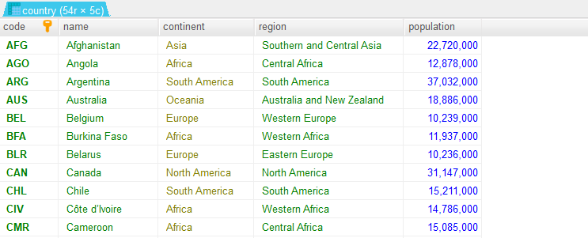
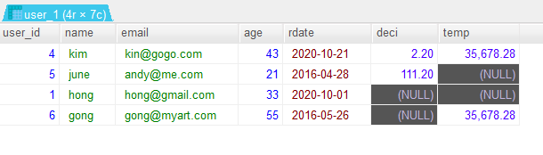
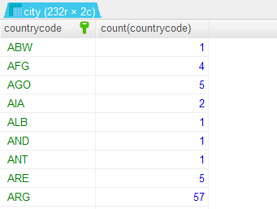

# MySQL 문법 기본 정리
- HidiSQL을 기반으로 정리함

## 데이터 베이스, 테이블 생성

### 1. 데이터 베이스 만들기
```sql
CREATE DATABASE taxi_trips ; 
```

### 2. 데이터 베이스 선택하기
```sql
USE taxi_trips ; 
```

### 3. 현재 선택된 데이터 베이스 확인
```spl
SELECT DATABASE() ; 
```


### 4. 테이블 만들기
- 현재 선택된 데이터 베이스 하위에 테이블이 만들어 진다.
- 기본구조

```spl
CREATE TABEL [테이블이름] (
     컬럼명 데이터유형 제약조건,
     컬럼명 데이터유형 제약조건,
     컬럼명 데이터유형 제약조건,
     ...
)
```

#### 1) 제약조건이 없는 테이블 생성
- 테이블 생성시 데이터 유형 설정

```sql
CREATE TABLE taxi_info_1 (
	location_id INT(10),
	pickup_datetime DATETIME,
	dispatching_base_num Varchar(20),	
	borough Varchar(20),
	zone Varchar(20),
	service_zone Varchar(20),
	dropoff_datetime DATETIME,
	dropoff_location_id INT(10),
	dropoff_borough Varchar(20),
	dropoff_zone Varchar(20),
	dropoff_service_zone Varchar(20)
) ;
```


#### 데이터 유형
- 실제 데이터에 따라서 어떤 데이터 유형을 설정할지 달라진다.
- 문자형 데이터 타입


- 숫자형 데이터 타입


- 날짜형 데이터 타입


- 이진 데이터 타입


#### 2) 제약조건이 있는 테이블 생성
- ```제약조건 constraint``` : 데이터를 입력받을 때 실행되는 검사 규칙
- **NOT NULL** : NULL 값을 저장할 수 없다. 다만 데이터 입력시 해당 필드의 데이터가 생략되더라도 입력은 된다. 
- **UNIQUE** : 서로 다른 값을 가져야 한다. 중복된 값을 저장할 수 없다. 
- **PRIMARY KEY** : NOT NULL과 UNIQUE 제약조건을 모두 설정한다. NULL 값을 가질 수 없고, 중복된 값을 갖지 못한다.
   - PRIMARY KEY는 한 테이블서 하나의 컬럼에만 적용할 수 있다. UNIQUE는 여러 테이블에 가능.
   - 단 기존의 컬럼의 제약조건을 PRIMARY KEY로 수정할 경우 NOT NULL 제약조건이 걸려 있어야 한다. 
   - 기본키라고도 부른다.
- **FOREIGN KEY** : 다른 테이블과 연결해 주는 기능이다. 외래키라고도 부른다.
   - FOREIGN KEY order -> REFERENCE customer : order 컬럼이 customer 컬럼을 참조한다. customer 컬럼에 따라서 order 컬럼의 입력이 변경된다.
- **FORIEGN KEY의 세부기능 설정**
   - ON DELETE 데이터 삭제, ON UPDATE 데이터 수정
   - CASCADE : 참조 컬럼에서 수정, 삭제가 발생하면 참조되는 컬럼에서도 동일 발생
   - SET NULL : 참조 컬럼에서 수정, 삭제가 발생하면 참조되는 컬럼은 NULL로 변경됨
   - NO ACTION : 참조 컬럼에서 수정, 삭제가 발생해도 참조되는 컬럼은 변경되지 않는다.
   - SET DEFAULT : 참조 컬럼에서 수정, 삭제가 발생하면 참조되는 컬럼은 기본값으로 변경된다.
   - RESTRICT : 참조 컬럼에 데이터가 남아있으면, 참조되는 테이블의 데이터를 수정, 삭제할 수 없다. 
   - FORIEGN KEY는 따로 정리할 것
- **DEFAULT** : 데이터를 저장할 때 컬럼에 별도의 저장값이 없으면 DEAFAULT로 설정된 값이 저장된다.
- **AUTO_INCREMENT** : 주로 테이블의 PRIMARY KEY 데이터를 저장할 때 자동으로 숫자를 1씩 증가시켜 준다. 


```sql
CONSTRAINT 외래키명
FOREIGN KEY (참조되는 컬럼명)
REFERENCES 참조테이블명(참조 컬럼명) ON DELETE CASCADE
```

- 제약조건이 있는 테이블 생성
```sql
CREATE TABLE taxi_info_2 (
	location_id INT(10) PRIMARY KEY,
	pickup_datetime DATETIME,
	dispatching_base_num Varchar(20),
	borough Varchar(20),
	zone Varchar(20) NOT NULL,
	service_zone Varchar(20) NOT NULL,
	dropoff_datetime DATETIME,
	dropoff_location_id INT(10) UNIQUE,
	dropoff_borough Varchar(20),
	dropoff_zone Varchar(20) UNIQUE,
	dropoff_service_zone Varchar(20)
) ;
```


### 4. 데이터 베이스, 테이블 수정하기
- 유형, 제약조건, 컬럼 등을 수정, 삭제 할 수 있다.
- ALTER DATABASE 데이터베이스명 수정내용
- ALTER TABLE 테이블명 수정내용

#### 1) 데이터 베이스의 encoding 변경
- 데이터 특징에 따라서 encoding 값을 변경해주어야 한다. 

- encoding 확인

```sql
SHOW VARIABLES LIKE "character_set_database" ;
```


- encoding 변경

```sql
ALTER DATABASE taxi_trips CHARACTER SET = utf8 ;
ALTER DATABASE taxi_trips CHARACTER SET = ascii ; 
```


#### 2) 테이블에 컬럼 추가하기
- taxi_info_2 테이블에 tmp 컬럼을 추가하고 유형을 TEXT로 지정

```sql
ALTER TABLE taxi_info_2 ADD tmp TEXT ; 
```


#### 3) 테이블 유형 변경하기
- taxi_info_2 테이블의 tmp 컬럼의 데이터 유형을 INT(10)으로 변경

```sql
ALTER TABLE taxi_info_2 MODIFY COLUMN tmp INT(10) ;
```


#### 4) 테이블에서 컬럼 삭제하기
- taxi_info_2 테이블에서 tmp 컬럼 삭제

```sql
ALTER TABLE taxi_info_2 DROP tmp ;
```

#### 5) 데이터 베이스 삭제하기
- 현재 데이터 베이스 확인

```sql
SHOW DATABASES ;
```


- test 데이터 베이스 삭제

```sql
DROP DATABASE test ;
```


#### 6) 데이터 베이스, 테이블 생성, 삭제 
- **테이블의 수정, 변경등은 반드시 "USE 데이터베이스이름" 으로 현재 작업 위치를 바꿔주어야 한다.**
```sql
CREATE DATABASE tmp ;
USE tmp ;
CREATE TABLE tmp(id INT(10), name CHAR(10), notice VARCHAR(10)) ;
DROP TABLE tmp ;
DROP DATABASE tmp ;
```

### 5. 데이터 입력
- taxi_trips 데이터 베이스의 taxi_info_1 테이블에 데이터를 입력한다.
   - 테이블명 뒤의 컬럼명은 입력안해도 된다.
   - 입력 데이터의 갯수는 컬럼의 수와 일치 해야 한다.
   - 테이블의 데이터 유형에 맞도록 데이터를 입력해야 한다. 

```sql
INSERT INTO 테이블명 (컬럼1, 컬럼2, ...)
VALUES 
(데이터1, 데이터2, ...)
(데이터1, 데이터2, ...)


INSERT INTO taxi_info_1(location_id, pickup_datetime, dispatching_base_num, borough,
zone, service_zone, dropoff_datetime, dropoff_location_id, dropoff_borough,
dropoff_zone, dropoff_service_zone)
VALUES
(1, "2021-03-24", "100", "mapo", "red zone", "mapo_2", "2021-03-24", 10,
"gangnam", "yellow zone", "gangnam_2"),
(2, "2021-03-24", "200", "guro", "blue zone", "guro_3", "2021-03-24", 20,
"jongro", "red zone", "jongro_2") ;
```


## 데이터 서치

### 1. SELECT
- 기본 사용
   - SELECT 다음에 사용할 컬럼명을 나열한다.
   - FROM 다음에 테이블명을 입력한다.

```sql
SELECT <column_name_1>, <column_name_2>, <column_name_3>, ...
FROM <table_name> ;
```

- 전체 컬럼 불러오기
- SELECT에 `*`을 사용

```sql
SELECT *
FROM city ;
```


- 일부 컬럼 불러오기

```sql
SELECT name, countrycode
FROM city ;
```


### 2. ALIAS
- 컬럼을 불러올 때 alias(as)를 사용하여 컬럼명을 변경할 수 있다.
   - name -> re_name, countyrcode -> re_countrycode
   - 테이블에 저장되는 것은 아니다. 불러올 때만 컬럼명이 바뀐다.

```sql
SELECT name as "re_name", countrycode as "re_country_code"
FROM city ;
```


### 3. DISTINCT
- 중복데이터를 제거하여 불러온다.
   - countrycode에서 중복인 데이터를 하나로 합쳐서 불러오기

```sql
SELECT DISTINCT(countrycode)
FROM city ;
```

### 4. WHERE 
- WHERE절을 이용하여 검색 조건을 추가할 수 있다.
   - AND, OR, 연산자 등의 기능을 사용할 수 있다.

- 인구가 100만명 이상인 데이터 불러오기

```sql
SELECT *
FROM city
WHERE population >= 1000000 ;
```


#### AND 를 사용하여 여러가지 조건 추가
- id가 50 이하이고 인구수가 100만명 이상인 데이터 불러오기

```sql
SELECT *
FROM city
WHERE id <= 50 AND population >= 1000000 ;
```


#### OR 을 사용하여 여러가지 조건 추가
- surfacearea 가 60만 이상이거나 또는 인구수가 1000만명 이상인 데이터 불러오기 (일부컬럼 선택)

```sql
SELECT code, name, continent, region, surfacearea, population
FROM country
WHERE surfacearea >= 600000 OR population >= 10000000 ;
```


#### BETWEEN 을 사용하여 여러가지 조건 추가
- 하나의 조건의 범위를 지정해준다.
- 인구수가 1천만 이상 5천만 이하인 데이터 불러오기

```sql
SELECT code, name, continent, region, population
FROM country
WHERE population BETWEEN 10000000 AND 50000000 ;
```




### 5. ORDER BY
- 데이터 정렬
   - 기본값 오름차순 ASC
   - 내림차순 DESC

#### city 데이터에서 name 컬럼을 오름차순으로 정렬하여 데이터 불러오기

```sql
SELECT *
FROM city
ORDER BY name ;
```


#### city 데이터에서 population 컬럼을 내림차순으로 정렬하여 데이터 불러오기

```sql
SELECT *
FROM city
ORDER BY population DESC ;
```


#### city 데이터에서 countrycode는 오름차순, population은 내림차순으로 불러오기
- 나라별코드에서 인구가 많은 순서데로 데이터를 불러올 수 있다.

```sql
SELECT *
FROM city
ORDER BY countrycode, population DESC ;
```


### 6. CONCAT
- SELECT 한 컬럼의 데이터를 합쳐서 하나의 컬럼으로 불러오는 기능
- CONCAT()안에 합칠 컬럼명을 나열한다.
   - 데이터의 순서가 뒤에 오는 컬럼명은 " " 안에 기호나 공백을 사용할 수 있다.
   - ``" ",," "`` : 이러한 구조는 지켜져야한다.

```sql
SELECT 컬럼명1, CONCAT(컬럼명2, "기호",컬럼명3,"기호")
FROM 테이블명 ;
```

#### country 데이터에서 population과 gnp 컬럼을 하나로 합쳐서 불러오기
- 나라별로 인구수와 gnp 데이터를 하나의 컬럼에서 볼 수 있다.
- alias를 사용하여 컬럼명을 변경

```sql
SELECT name, CONCAT(population, " / ",gnp,"") as pop_gnp
FROM country ;
```


#### country 데이터에서 name과 code 컬럼을 하나로 합쳐서 불러오기
- 나라의 이름과 나라의 코드 데이터를 하나의 컬럼에서 볼 수 있다.

```sql
SELECT CONCAT(name, " (",code,")") as name_code, continent, region, surfacearea
FROM country ;
```


### 7. LIKE
- 특정한 문자가 포함된 데이터를 불러올 수 있다.
- WHERE 절에 사용
- % 기호를 붙이면 검색할 문자외에 어떤 문자열이라도 올 수 있다는 의미이다.

```sql
WHERE 컬럼명 LIKE "문자"    : 문자만 검색
WHERE 컬럼명 LIKE "%문자"   : 문자 앞에 어떤 문자가 있어도 함께 검색 (문자가 뒤에 위치한다.)
WHERE 컬럼명 LIKE "문자%"   : 문자 뒤에 어떤 문자가 있어도 함께 검색 (문자가 앞에 위치한다.)
WHERE 컬럼명 LIKE "%문자%"  : 문자의 앞뒤에 어떤 문자가 있어도 함께 검색 (문자가 가운데에 위치한다.)
```

- NOT을 붙이면 문자가 없는 것을 검색한다.

```
WHERE 컬럼명 NOT LIKE "문자"
```

#### city 테이블의 contrycode 컬럼에서 U 문자가 들어간 데이터 불러오기
- %가 앞에 있으므로 U가 뒤에 위치한 데이터를 불러온다.

```sql
SELECT *
FROM city
WHERE countrycode LIKE "%U" ;
```


- %가 뒤에 있으면 U가 앞에 위치한 데이터를 불러온다.

```sql
SELECT *
FROM city
WHERE countrycode LIKE "U%" ;
```


#### user_1 테이블의 email 컬럼에서 daum 메일이 아닌 데이터 불러오기

```sql
SELECT *
FROM user_1
WHERE email NOT LIKE "%@daum%" ;
```




### 8. IN
- WHERE 절에서 여러개의 조건을 사용할 때 간단하게 할 수 있다.
- 검색조건 OR 검색조건의 의미이다

```
WHERE 컬럼 IN ("검색조건", "검색조건", "검색조건")
```

#### city 테이블에서 countrycode 컬럼의 데이터가 AFG 또는 NLD 불러오기
- IN을 사용하지 않았을 때

```sql
SELECT *
FROM city
WHERE countrycode = "AFG" OR countrycode = "NLD" ;
```

- IN을 사용했을 때

```sql
SELECT *
FROM city
WHERE countrycode IN ("AFG", "NLD") ;
```


### 9. LIMIT
- 검색 결과의 수를 설정한다.
- 데이터의 크기가 클 경우 LIMIT을 설정하여 데이터의 일부분만 출력하는 것이 좋다.
   - 조회시간을 단축 할 수 있고, 업데이트시의 실수를 줄일 수 있다.

#### city 테이블에서 위에서 3번째까지의 데이터 불러오기

```sql
SELECT *
FROM city
LIMIT 3 ;
```


#### city 테이블에서 위에서 10번쨰까지의 데이터 불러오기

```sql
SELECT *
FROM city
LIMIT 10 ;
```


#### city 테이블에서 위에서부터 4번째부터 5번쨰 후까지 데이터 불러오기
- LIMIT a, b : (a+1) 부터 (a+1) + (b-1) 까지
   - LIMIT 3, 5 : (3+1) 부터 (3+1) + (5-1) 까지 

```sql
SELECT *
FROM city
LIMIT 3, 5 ;
```


#### city 테이블에서 위에서부터 16번째부터 13번째 후까지 데이터 불러오기
- LIMIT 15, 14 : 16 ~ 29 까지 데이터

```sql
SELECT *
FROM city
LIMIT 15, 14 ;
```


### 10. UPDATE
- 테이블의 데이터 값을 업데이트 해준다.
- WHERE 절에서 변경할 데이터를 정하고 SET 절에서 변경값을 입력해준다.

```
UPDATA <테이블명>
SET <컬럼명>=변경값, <컬럼명>="변경값"
WHERE <컬럼명>=현재값
```

#### user_1 테이블의 name이 gong인 데이터의 email과 age값 update
- 변경전 user_1 테이블의 데이터


- 변경후 user_1 테이블의 데이터

```sql
UPDATE user_1
SET email="gong_1234@gmail.com", age=30
WHERE name="gong" ;
```


### 11. DELETE
- 데이터 삭제
- WHERE 절과 함께 사용하면 특정 조건의 데이터를 삭제할 수 있다.

#### user_1 테이블에서 2018년 이전의 데이터 삭제
- user_1의 2018년 이전 데이터


- user_1의 2018년 이전 데이터 삭제

```sql
DELETE FROM user_1
WHERE rdate < "2018-01-01" ;
```


### 12. GROUP BY
- 특정 컬럼의 동일한 데이터를 하나로 묶어준다.
- 그룹함수를 함께 사용하여 연산을 할 수 있다.
   - count, min, max, avg, sum

#### count 함수 
- city 테이블에서 countrycode별 갯수 계산
- countrycode 컬럼을 GROUP BY로 묶어준다.
   - SELECT 에서 countrycode 만 선택하면 중복데이터가 사라진 countrycode가 나온다.
   - SELECT 에서 count(countrycode)만 선택하면 중복데이터 사라진 countrycode 별 갯수가 나온다.
   - SELECT 에서 countrycode와 count(countrycode)를 함께 선택하면 코드와 코드별 갯수가 나온다.

```sql
SELECT countrycode, count(countrycode)
FROM city
GROUP BY countrycode ;
```



- city 테이블에서 전체 코드의 갯수 계산
- countrycode를 중복데이터를 제거하고 count로 갯수를 세어준다.

```sql
SELECT count(distinct(countrycode)) as code_count
FROM city ; 
```


#### max 함수
- country 테이블에서 대륙별 최대인구와 최대 gnp 계산

```sql
SELECT continent, max(population) as population, max(gnp) as gnp
FROM country
ORDER BY continent ;
```


#### min 함수
- country 테이블에서 대륙별 최소인구수와 최소 gnp 계산
- population과 gnp가 0이 아닌 데이터 중에서 계산
- **WHERE 절은 GROUP BY보다 앞에 사용한다.**

```sql
SELECT continent, min(population) as pop, min(gnp) as gnp
FROM country
WHERE population != 0 AND gnp != 0
GROUP BY continent ; 
```


#### sum 함수
- country 테이블에서 대륙별 총인구수와 gnp합계 계산

```sql
SELECT continent, sum(population) as pop_sum, sum(gnp) as gnp_sum
FROM country
WHERE population != 0 AND gnp != 0
GROUP BY continent ; 
```


#### avg 함수
- country 테이블에서 대륙별 평균 인구수와 평균 gnp 계산
- population과 gnp의 값이 0이 아닌 데이터만 사용
- 평균 인구수의 내림차순으로 정렬
- **ORDER BY는 GROUP BY 다음에 사용한다**

```sql
SELECT continent, AVG(population) as pop_avg, AVG(gnp) as gnp_avg
FROM country
WHERE population != 0 AND gnp != 0
GROUP BY continent
ORDER BY pop_avg DESC ; 
```


### 13. HAVING
- GROUP BY 의 결과에 대한 조건을 설정할 수 있다.
   - WHERE 절은 GROUP BY 앞에 사용
   - **HAVING 절은 GROUP BY 뒤에 사용**

#### country 테이블에서 대륙별 총인구수를 구하고 5억명 이상인 대륙만 계산

```sql
SELECT continent, SUM(population) as pop
FROM country
GROUP BY continent
HAVING pop >= 500000000 ;
```


#### country 테이블에서 대륙별 평균인구수, 평균GNP, 1인당 평균GNP를 계산
- population과 gnp가 0이 아닌 데이터만 사용
- 1인당 gnp 값이 0.01 이상인 데이터만 조회
- 1인당 gnp 값으로 내림차순 정렬

```sql
SELECT continent, AVG(population) as pop_avg, AVG(gnp) as gnp_avg,
	(AVG(population) / AVG(gnp)) * 1000 as avg
FROM country
WHERE population != 0 AND gnp != 0
GROUP BY continent
HAVING avg >= 0.01
ORDER BY avg DESC ;
```


