# 하이디 SQL과 구글 클라우드 SQL 서버 연결하기
- 평소 MySQL 관리, 공부를 위해서 hidisql를 사용했었다. hidisql은 AWS의 개인 서버와 연결이 되어 있었다. 
- 최근에 구글 클라우드 플랫폼의 데이터베이스 관리를 위한 다양한 프로그램들에 관심이 생겨서 독학을 하고 있었다. 구글 클라우드의 빅쿼리, 스토리지, 데이터스튜디오, 애널리틱스 등을 연결하면 빅데이터를 분석하고 아이디어를 추출하여 시각화하는 과정을 효율적으로 관리해 볼 수 있을 것 같았기 때문이다. 
- 그러다 구글 클라우드의 SQL 서버를 알게 되었고 AWS의 인스턴스와 비슷한 기능을 한다는 것을 확인했다. 그래서 hidisql을 구글 SQL 인스턴스와 연결을 해보게 되었다. 
   - 대용량 데이터는 구글 빅쿼리를 통해서 분석하고, 저용량 데이터는 hidisql을 사용하는 방향으로 워크플로우를 계획해보았다. 구글 빅쿼리가 대용량 데이터 분석에 성능이 좋은데, 막상 저용량, 작은 규모의 분석에서는 그다지 성능이 좋지 않다는 어느 블로그 글을 보았던 이유에서.
- 수십차례의 실패 끝에 여러가지 docs를 참고하다가 드디어 hidisql과 구글 SQL 서버를 연결하는데 성공했다. 그 과정을 공유 하고자 한다.

### 구글 SQL 서버 생성
- 구글 SQL 서버를 생성하는 과정은 어렵지 않았다. 구글 클라우드에서 시키는데로만 하면 손쉽게 생성할 수 있었다.
- SQL 첫 페이지에서 상단의 "인스턴스 만들기" 클릭한다.
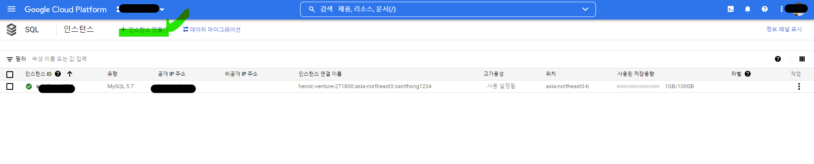
- 인스턴스 만들기에서 데이터베이스 엔진을 선택한다. 자세한 기능을 알아가는 것은 조금 미뤄두고 MySQL 엔진을 선택했다.
   - 3가지 엔진 타입이 있고 각각의 타입에 대한 기능 설명 참조
   - https://cloud.google.com/sql/?_ga=2.225143833.-2023896195.1647492286&_gac=1.153564618.1647660598.Cj0KCQjw29CRBhCUARIsAOboZbIWHUDQ21DP7Uj8F3-DZq-gbSinMHyBO-986aTk9q1OyOBkOZ59KLsaAlp-EALw_wcB
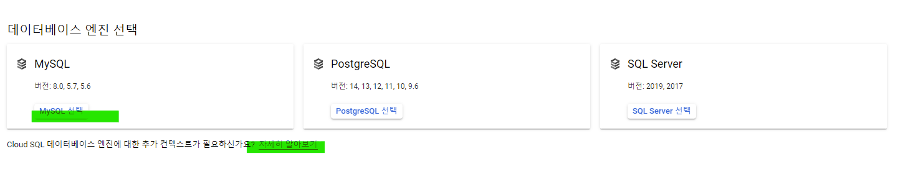
- MySQL 인스턴스 만들기에서 인스턴스 정보설정과 인스턴스 맞춤설정을 해준다. 기본적인 사항만 입력했고, 맞춤설정의 여러가지 기능은 아직 잘 모르기에 따로 설정을 하지 않았다. 머신 유형, 저장용량, 백업여부, 유지보수 등의 여러가지 설정이 가능하다.
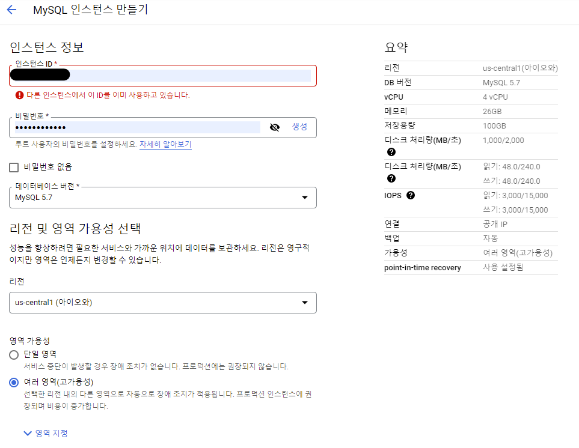
- 인스턴스를 생성 후 인스턴스 ID를 클릭하면 인스턴스에 대한 대시보드가 나온다. 개요 화면에서 여러가지 정보를 한눈에 파악할 수 있다.
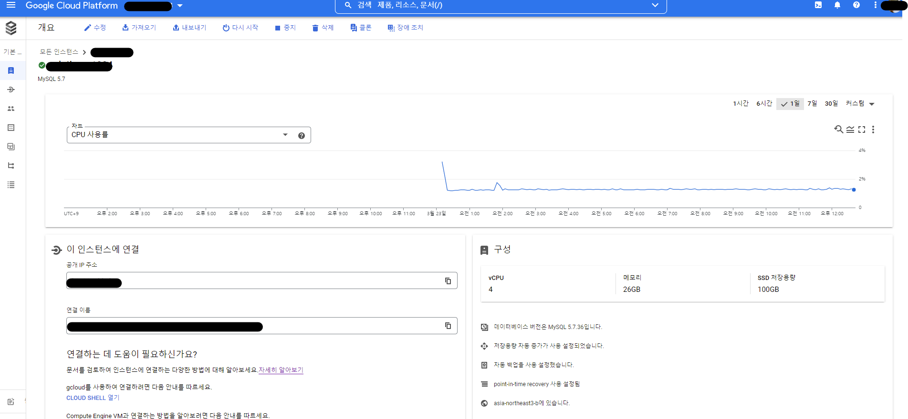

### 하이디 SQL 연결 화면
- 하이디 SQL을 실행하면 세션 관리자 팝업창이 뜬다. 여기에서 내가 연결할 sever를 지정해 준다. 문제는 이 세션에 구글 SQL 인스턴스를 연결해주어야 한다.
   - 신규를 눌러 새로운 세션을 생성한다. 세션이름 입력 후 설정에서 입력값을 변경해준다.
   - 네트워크 유형은 우선 내가 만든 구글 SQL의 유형과 가장 비슷한 것으로 선택했다. MariaDB or MySQL(TCP/IP)
   - 라이브러리는 네트워크 유형을 선택하면 자동으로 선택된다. 
   - 구글 SQL의 생성한 인스턴스 개요 화면에 공개 IP 주소를 입력했다.
   - 사용자는 구글 SQL의 메뉴중 사용자 메뉴를 선택하면 내 인스턴스의 사용자 이름이 나온다. 이것을 입력했다.
   - 암호는 구글 SQL에서 인스턴스 사용자에 대해 설정한 비밀번호를 입력했다. 인스턴스를 처음 생성할 때 만든 비번과 다른 비번이다. 사용자 root 에 대한 비번이다. 이것을 변경하고 싶으면 사용자 탭에서 더보기(점3개)를 눌러 비밀번호 변경을 할 수 있다.
   - 포트는 국제 포트번호 할당규칙에 따라서 3306 (MySQL)을 입력했다. 여러가지 포트번호에 대한 기능을 익혀두면 좋을 것 같다.
- 새로운 세션을 만들었다. 열기버튼을 누른다.
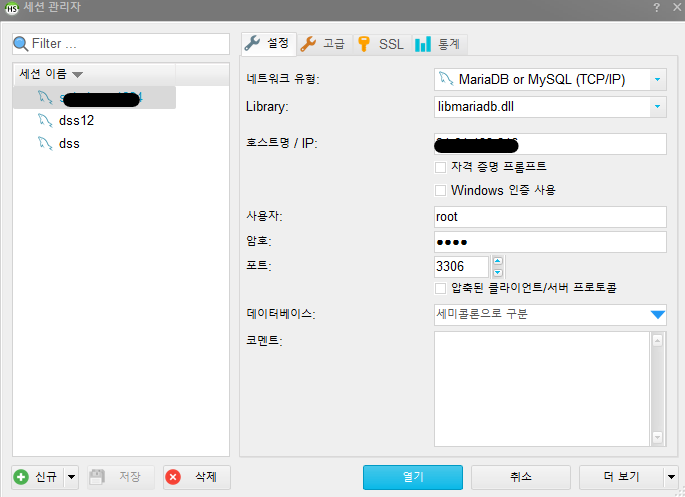
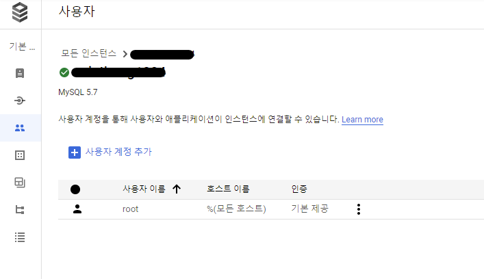
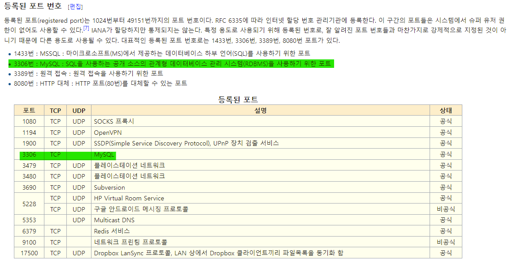

### 구글 SQL의 인스턴스에 접근하기 위한 네트워크 승인필요
- 하이디 SQL의 새로운 세션을 잘 입력한 후 연결을 눌렀는데 연결에 실패했다. 통신, 서버 세팅에서 연결 실패가 뜨면 거의 멘붕이 오지 않던가?
- 이런 경우 경험적으로 몇가지 이유 때문에 연결이 안되는 것을 알고 있다.
   - 어차피 통신,서버 관련 복잡한 용어와 기능들을 알지는 못한다.
   - 구글링을 하면 우선 내가 접근한 방식이 틀리지 않았다는 것을 알 수 있다.
   - 연결을 시도하는 도구에서 설정값을 최대한 비슷한 것을 여러번 해본다.
   - 그래도 안되면 연결하고자 하는 쪽에서 문제를 해결한다.이때 이해하기 어려운 docs들을 뒤져가며 실마리를 찾아야한다.
- 구글 SQL의 docs들을 몇시간째 검색하던 중 인스턴스에 대한 액세스 구성에 관한 것을 보게 되었다. 직감적으로 인스턴스에 접근하기위한 설정을 변경해야 한다고 생각이 들었다.
   - docs를 살펴보면 인스턴스에 접근하려면 승인된 네트워크만 접속할 수 있고, 네트워크 추가를 하라는 내용이 있다. 
   - 아래 별표시 참고에 정확한 의미는 모르겠지만 무언가 내 컴퓨터의 IP주소를 추가하여 접근 승인을 하라는 것 같다.   - 그래서 눈에 들어온 것이 첫 부분의 "내 IP는 무엇인가요?" 파란글씨이다. 
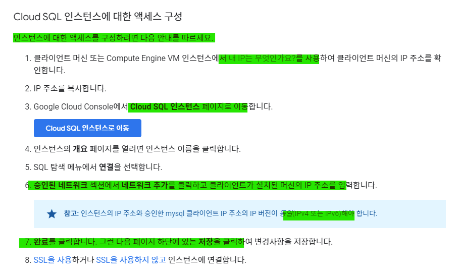

### 내 아이피 주소 확인 후 인스턴스에 네트워크 추가하기
- 내 아이피 주소?를 알아야 한다. 우선 구글 docs에 파란글씨를 눌러보았다. 친절하게도 내 IP주소를 알려주는 사이트가 연결 된다.
   - IPv4 와 IPv6 등 잘 모르는 개념들이 있지만,IPv4가 일반적인 값인 것 같다. 이것을 복사한다.
   - 그 다음 구글 SQL에서 연결 메뉴로 이동한다. 네트워킹 메뉴에 인스턴스에 접근할 수 있는 외부 IP 주소를 할당하는 공개IP 설정 메뉴를 선택한다. 
   - docs에서 시킨데로 승인된 네트워크에 내 IP 주소를 입력하기 위해 네트워크 추가를 선택하고 IP주소를 입력한다. 
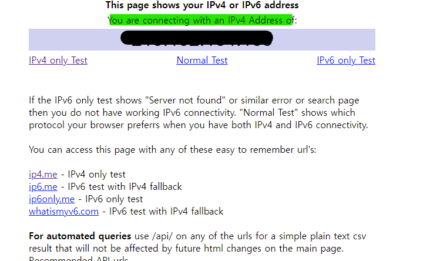
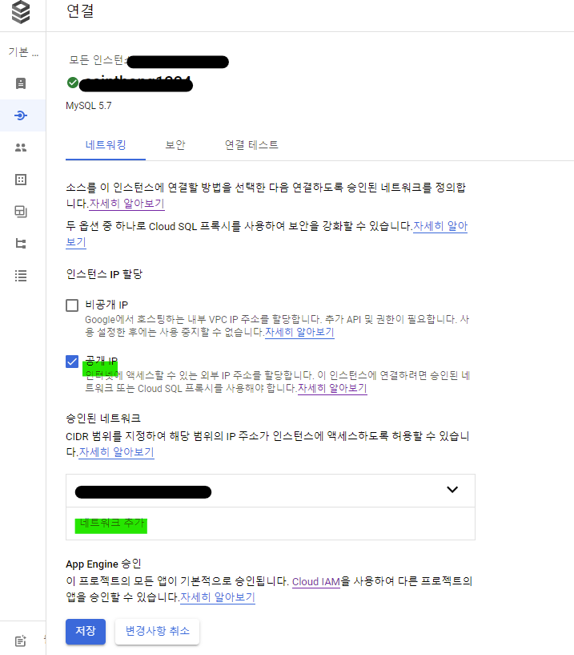

### 연결완료
- 하이디 SQL과 구글 SQL 서버에 연결 되었다.
   - 이제 열심히 SQL 문법을 공부하자...
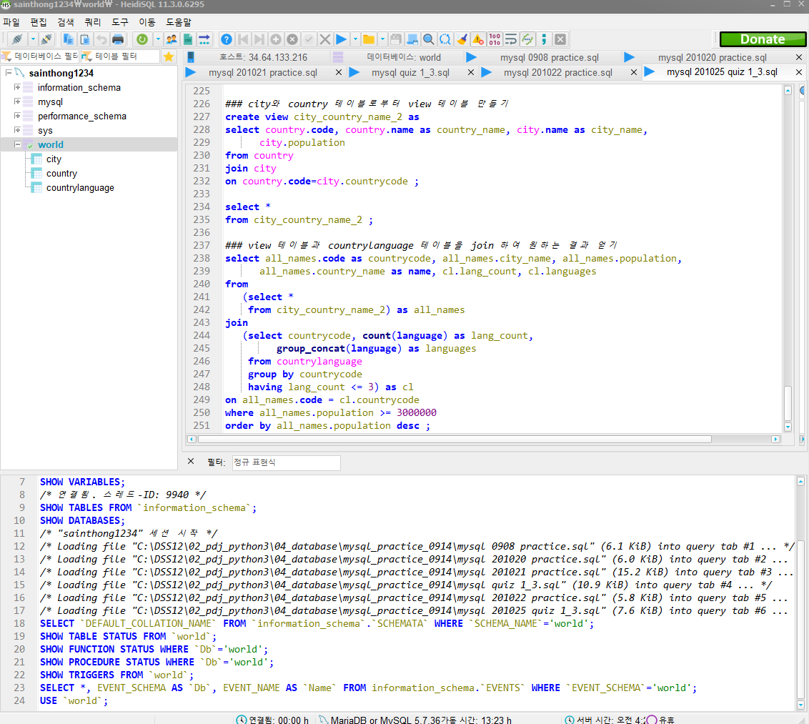

# 후기
- 구글 클라우드 플랫폼의 여러가지 기능에 대해서 공부할 것
   - 구글 빅쿼리 : 데이터 분석
   - 구글 스토리지 : 데이터의 종류와 타입, 데이터의 저장, 공유, 내보내기 등
   - 구글 SQL : 데이터베이스 서버로 어떻게 하면 효율적으로 사용할 수 있을지 기능 파악
   - 구글 데이터 스튜디오 : 데이터 분석한 결과를 효과적으로 시각화 하기, 공유하기, 대쉬보드 만들기 파악
   - 구글 애널리틱스 : 어플리케이션 또는 웹페이지의 활동 내역에 관한 기능 파악
   - 기타 MLOps와 관련된 구글 플랫폼의 기능들 공부하기
- 통신, 서버 관련 지식 공부할 것
