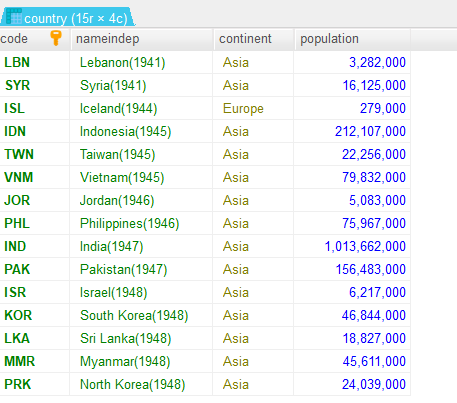
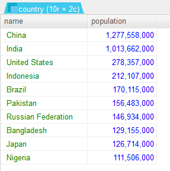

# MySQL Test
- world 데이터 베이스를 사용한 코딩 문제 테스트
- 테이블과 컬럼
    - city
        - id, name, countrycode, district, population
    - country
        - code, name, continent, region, surfacearea, indepyear, population, lifeexpectance
        - gnp, gnpold, localname, govermentform, headofstate, capital, code2
    - countrylanguage
        - countrycode, language, isofficial, percentage


### quiz 1
#### country 테이블에서 중복을 제거한 continent 조회

```sql
SELECT DISTINCT(continent)
FROM country ;
```


### quiz 2
#### 한국 도시중에 인구가 100만이 넘는 도시를 조회하고 인구수로 내림차순 하시오.

```sql
SELECT *
FROM city
WHERE countrycode LIKE ("KOR") AND population >= 1000000
ORDER BY population DESC ;
```


### quiz 3
#### city 테이블에서 인구수가 800만~1000만인 도시 데이터를 인구순으로 내림차순하시오.

```sql
SELECT name, countrycode, population
FROM city
WHERE population >= 8000000 AND population <= 10000000
ORDER BY population DESC ; 
```
```sql
SELECT name, countrycode, population
FROM city
WHERE population BETWEEN 8000000 AND 10000000
ORDER BY population DESC ;
```


### quiz 4 
#### country 테이블에서 1940~1950년도 사이에 독립한 국가들을 조회하고 년도 순으로 오름차순 하시오

```sql
SELECT code, CONCAT(name, "(",indepyear,")") as nameindep, continent, population
FROM country
WHERE indepyear BETWEEN 1940 AND 1950
ORDER BY indepyear ;
```



### quiz 5
#### countrylanguage 테이블에서 스페인어, 한국어, 영어를 95% 이상 사용하는 국가 코들ㄹ percentage로 내림차수하시오.

```sql
SELECT countrycode, language, percentage
FROM countrylanguage
WHERE language IN ("spanish", "english", "korean") AND percentage >= 95.0
ORDER BY percentage DESC ;
```


### quiz 6
#### country 테이블에서 code가 A로 시작하고 govermentform에 republic이 포함되어 있는 데이터를 조회하시오.

```sql
SELECT code, name, continent, governmentform, population
FROM country
WHERE code LIKE "A%" AND governmentform LIKE "%republic%" ;
```


### quiz 7
#### country 테이블에서 몇개의 대륙이 있는지 조회하시오.
- group by 로 continent를 적용하면, 각 continent 가 몇개 있는지 조회된다.
- group by 가 아닌 distinct()를 사용하면 continent 종류가 몇개 있는지 조회 할 수 있다.

```sql
SELECT COUNT(DISTINCT(continent)) as count
FROM country ;
```


### quiz 8
#### country 테이블에서 continent별 몇개의 나라가 있는지 조회하시오.

```sql
SELECT continent, COUNT(continent) as count
FROM country
GROUP BY continent
ORDER BY count DESC ;
```


	
### quiz 8
#### city 테이블에서 국가코드 별로 총인구가 몇명인지 조회하고, 총인구가 5천만명 이상인 도시만 출력하시오.
#### 인구수로 내림차순 조회하시오.

```sql
SELECT countrycode, SUM(population) as population
FROM city
GROUP BY countrycode
HAVING population >= 50000000
ORDER BY population DESC ;
```


### quiz 9
#### countrylanguage 테이블에서 언어별 사용하는 국가수를 조회하고 많이 사용하는 언어를 5위에서 10위까지 조회하시오.
- limit
    - 5위 ~ 10위 : 시작 5-1=4, 끝 (10+1)-5=6
- 특정 컬럼으로 정렬을 하고, 같은 데이터일 경우 한번더 정렬을 해주어야 원하는 결과가 나온다. 
- order by A DESC, B DESC 

```sql
SELECT language, COUNT(language) as count
FROM countrylanguage
GROUP BY language
ORDER BY count DESC, language DESC
LIMIT 4, 6 ;
```


### quiz 10
#### countrylanguage 테이블에서 언어별 15개국가 이상에서 사용되는 언어를 조회하고 언어별 국가수에 따라서 내림차순 하시오.

```sql
SELECT language, COUNT(language) as count
FROM countrylanguage
GROUP BY language
HAVING count >= 15
ORDER BY count DESC ;
```


### quiz 11
#### country 테이블에서 대륙별 전체 표면적의 크기를 구하고 표면적 크기 순으로 내림차순 하시오.

```sql
SELECT continent, ROUND(SUM(surfacearea), 0) as surfacearea
FROM country
GROUP BY continent
ORDER BY surfacearea DESC ;
```


- 숫자에서 천단위 구분표시인 콤마를 없애려면 REPLACE(a, '기호', '바꾸고 싶은 내용')를 사용한다.
- 이렇게 콤마를 제거한 후 정렬을 하면 숫자의 크기로 인식하지 않고 문자 처럼 인식을 한다. 

```sql
SELECT continent, REPLACE(ROUND(SUM(surfacearea), 0), ',','') as surface
FROM country
GROUP BY continent
ORDER BY surface DESC ;
```


### quiz 12
#### 멕시코 보다 인구가 많은 나라이름과 인구수를 조회하고 인구수 순으로 내림차순하시오.
- where 절에서 subquery를 만들어서 이중 조건을 만들어 준다.
- population 값을 조회하는데, name이 mexico인 데이터의 population 보다 큰 값을 조회한다.

```sql
select name, population
from country
where population > (
      select population
      from country
      where name = "mexico")
order by population desc ;
```



### quiz 13
#### 국가별 몇개의 도시가 있는지 조회하고 도시수 순으로 10까지 내림차순하시오.

```sql
select country.name, count(city.name) as count
from city
join country
on city.countrycode = country.code
group by country.name
order by count desc
limit 10 ;
```


### quiz 14
#### 언어별 사용인구를 출력하고 언어 사용인구 순으로 10위까지 내림차순하시오.
- form절에서 subquery를 사용하여 countrylanguage 테이블을 가져오고, join으로 country 테이블과 합한다.
- 합한 뒤, language로 group by한 후 percentage와 population의 곱을 더해준다.
    - 왜냐하면 언어를 사용하는 국가가 여러개이기 때문

```sql
select cl.language, round(sum(cl.percentage * country.population), 0) as count
from (select countrycode, language, percentage
     from countrylanguage) as cl
join country
on cl.countrycode = country.code
group by cl.language
order by count desc
limit 10 ;
```


### quiz 15
#### 나라 전체 인구의 10% 이상인 도시에서 도시인구가 500만이 넘는 도시를 조회하시오.

```sql
select city.name, city.countrycode, country.name,
       round((city.population / country.pop) * 100, 2) as percentage
from (select * from city where population >= 5000000) as city
join (select code, name, population as pop from country) as country
on city.countrycode = country.code
HAVING percentage >= 10
order by percentage desc ;
```


### quiz 16
#### 면적이 10000km^2 이상인 국가의 인구밀도를 구하고, 인구밀도가 200 이상인 국가중에서 사용하고 있는 언어의 수가 5가지 이상인 나라를 조회하시오.

```sql
select country.name, count(cl.language) as language_count
from (select code, name, round((population / surfacearea), 0) as density
      from country
      where surfacearea >= 10000
      having density >= 200
      order by density desc ) as country
join (select * from countrylanguage) as cl
on country.code = cl.countrycode
group by country.name
having language_count >= 5
order by language_count desc ;
```


### quiz 17
#### 사용하는 언어가 3가지 이하인 국가중 도시인구가 300만 이상인 도시를 조회하시오
- from 절과 join 절에 subquery를 사용하여 3개 테이블의 데이터를 조회한다. 
    - from 절에서는 countrylanguage 테이블에서 국가코드별로 group by 하여, 언어종류와 언어의 갯수를 조회한다.
    - join 절에서는 city 테이블과 country 테이블을 join하고 도시인구와 국가코드를 조회한다. 
- `group_concat()` 함수를 사용하여 group by한 결과의 값들을 한 셀에 합친다.

```sql
select cl.countrycode, city.city_name, city.population, cl.language_count, city.code, cl.lang
from (select countrycode, count(language) as language_count, group_concat(language) as lang
     from countrylanguage
     group by countrycode
     having language_count <= 3
     order by language_count desc) as cl
join (select city.countrycode, city.name as city_name, city.population, country.code
     from city
     join country
     on city.countrycode = country.code
     where city.population >= 3000000 ) as city
on cl.countrycode = city.countrycode
order by population desc ;
```


#### view 테이블 만들어서 조회하기
- city와 country 테이블로부터 view 테이블을 만든다.
- 최종 조회에서 국가이름이 필요하기 때문

```sql
create view city_country_name_2 as
select country.code, country.name as country_name, city.name as city_name,
       city.population
from country
join city
on country.code=city.countrycode ;

select *
from city_country_name_2 ;
```
- view 테이블과 countrylanguage 테이블을 join 하여 원하는 데이터 조회하기
    - from 절의 subquery로 view 테입을을 사용함

```sql
select all_names.code as countrycode, all_names.city_name, all_names.population,
       all_names.country_name as name, cl.lang_count, cl.languages 
from 
    (select *
    from city_country_name_2) as all_names
join
    (select countrycode, count(language) as lang_count,
    group_concat(language) as languages
    from countrylanguage
    group by countrycode
    having lang_count <= 3) as cl
on all_names.code = cl.countrycode
where all_names.population >= 3000000
order by all_names.population desc ;
```

