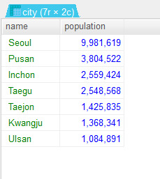

# MySQL Test
- world 데이터 베이스를 사용한 코딩 문제 테스트
- 테이블과 컬럼
    - city
        - id, name, countrycode, district, population
    - country
        - code, name, continent, region, surfacearea, indepyear, population, lifeexpectance,
	- gnp, gnpold, localname, govermentform, headofstate, capital, code2
    - countrylanguage
        - countrycode, language, isofficial, percentage


### quiz 1
#### country 테이블에서 중복을 제거한 continent 조회

```sql
SELECT DISTINCT(continent)
FROM country ;
```


### quiz 2
#### 한국 도시중에 인구가 100만이 넘는 도시를 조회하고 인구수로 내림차순 하시오.

```sql
SELECT *
FROM city
WHERE countrycode LIKE ("KOR") AND population >= 1000000
ORDER BY population DESC ;
```


### quiz 3
#### city 테이블에서 인구수가 800만~1000만인 도시 데이터를 인구순으로 내림차순하시오.

```sql
SELECT name, countrycode, population
FROM city
WHERE population >= 8000000 AND population <= 10000000
ORDER BY population DESC ; 
```
```sql
SELECT name, countrycode, population
FROM city
WHERE population BETWEEN 8000000 AND 10000000
ORDER BY population DESC ;
```


### quiz 4 
#### country 테이블에서 1940~1950년도 사이에 독립한 국가들을 조회하고 년도 순으로 오름차순 하시오

```sql
SELECT code, CONCAT(name, "(",indepyear,")") as nameindep, continent, population
FROM country
WHERE indepyear BETWEEN 1940 AND 1950
ORDER BY indepyear ;
```


### quiz 5
#### countrylanguage 테이블에서 스페인어, 한국어, 영어를 95% 이상 사용하는 국가 코들ㄹ percentage로 내림차수하시오.

```sql
SELECT countrycode, language, percentage
FROM countrylanguage
WHERE language IN ("spanish", "english", "korean") AND percentage >= 95.0
ORDER BY percentage DESC ;
```


### quiz 6
#### country 테이블에서 code가 A로 시작하고 govermentform에 republic이 포함되어 있는 데이터를 조회하시오.

```sql
SELECT code, name, continent, governmentform, population
FROM country
WHERE code LIKE "A%" AND governmentform LIKE "%republic%" ;
```


### quiz 7
#### country 테이블에서 몇개의 대륙이 있는지 조회하시오.
- group by 로 continent를 적용하면, 각 continent 가 몇개 있는지 조회된다.
- group by 가 아닌 distinct()를 사용하면 continent 종류가 몇개 있는지 조회 할 수 있다.

```sql
SELECT COUNT(DISTINCT(continent)) as count
FROM country ;
```


### quiz 8
#### country 테이블에서 continent별 몇개의 나라가 있는지 조회하시오.

```sql
SELECT continent, COUNT(continent) as count
FROM country
GROUP BY continent
ORDER BY count DESC ;
```


	
### quiz 8
#### city 테이블에서 국가코드 별로 총인구가 몇명인지 조회하고, 총인구가 5천만명 이상인 도시만 출력하시오.
#### 인구수로 내림차순 조회하시오.

```sql
SELECT countrycode, SUM(population) as population
FROM city
GROUP BY countrycode
HAVING population >= 50000000
ORDER BY population DESC ;
```


### quiz 9
#### countrylanguage 테이블에서 언어별 사용하는 국가수를 조회하고 많이 사용하는 언어를 5위에서 10위까지 조회하시오.
- limit
    - 5위 ~ 10위 : 시작 5-1=4, 끝 (10+1)-5=6
- 특정 컬럼으로 정렬을 하고, 같은 데이터일 경우 한번더 정렬을 해주어야 원하는 결과가 나온다. 
- order by A DESC, B DESC 

```sql
SELECT language, COUNT(language) as count
FROM countrylanguage
GROUP BY language
ORDER BY count DESC, language DESC
LIMIT 4, 6 ;
```


### quiz 10
#### countrylanguage 테이블에서 언어별 15개국가 이상에서 사용되는 언어를 조회하고 언어별 국가수에 따라서 내림차순 하시오.

```sql
SELECT language, COUNT(language) as count
FROM countrylanguage
GROUP BY language
HAVING count >= 15
ORDER BY count DESC ;
```


