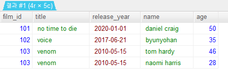

# join
- 여러개의 테이블을 합해준다. 
- 기본적으로 inner join, left join, right join, outer join 이 있다.
- 행을 기준으로 데이터를 합한다.
- 헷갈리는 부분 : left join 과 right join의 기준 테이블과 합쳐지는 테이블의 개념
    - 많은 블로그들에서 left join과 right join을 모호하게 설명한다. 확실하게 알고 가자.


## database 생성

```sql
create database example ;
```

## database 선택

```sql
use example ;
```

## table 생성
- film 테이블
- film_id, title, release_year 컬럼

```sql
create table film_table(
	film_id INT,
	title Varchar(20) NOT NULL,
	release_year DATE) ;
```

- actor 테이블
- film_id, name, age 컬럼

```sql
create table actor_table(
	film_id INT,
	name Varchar(20) NOT NULL,
	age INT(3) DEFAULT '30') ;
```

## 테이블 별 데이터 생성
- film 테이블에 영화 데이터 넣기

```sql
insert into film_table(film_id, title, release_year)
values (101, "no time to die", "2020-01-01"),
(102, "voice", "2017-06-21"),
(103, "venom", "2010-05-15"),
(105, "dune", "2009-09-09") ;
```

- actor 테이블에 배우 데이터 넣기

```sql
insert into actor_table(film_id, name, age)
values (101, "daniel craig", 50),
(102, "byunyohan", 35),
(103, "tom hardy", 46),
(103, "naomi harris", 28) ;
```

## 데이터 확인
- actor 테이블 확인

```sql
select *
from actor_table ;
```


- film 테이블 확인

```sql
select *
from film_table ;
```


## join
- 기본적으로 inner join 에 해당한다.
- film 테이블과 actor 테이블을 join
- 공통된 컬럼의 값을 기준으로 두 테이블에서 값을 가져온다. (교집합)
- film_id 가 공통값이므로 이것을 기준으로 일치하는 값에 해당하는 행전부를 합해서 보여준다.

```sql
select film_table.film_id, film_table.title, film_table.release_year,
	actor_table.name, actor_table.age
from film_table
join actor_table
on film_table.film_id = actor_table.film_id ;
```



### left join, right join 
- left join과 right join은 다이어그램에서 볼 수 있듯이 직관적으로 left의 테이블의 데이터를 가져오고, right 테이블의 데이터를 가져온다는 것을 알 수 있다.
- 그렇다면 left와 right의 기준은 어떻게 설정할까? from 절에 오는 컬럼이 기준 테이블인가?
- 많은 블로그를 찾아봤지만 left join과 right join의 기능 설명이 애매모호하다.
- from 과 left join, right join 의 관계를 정확하게 알고 넘어가자.
- **핵심** :

```
LEFT JOIN 과 RIGHT JOIN은 기준테이블이 다르다.
```

#### left join
- left join의 핵심 : from 절의 테이블이 기준이고 left join 절의 테이블이 합해지는 테이블이다.

```
FROM a
LEFT JOIN b

>>>

a를 기준으로 b를 결합해라. 즉 a의 데이터는 전부, b의 데이터는 a와 겹치는 것만 출력된다.
```

- film_table을 기준으로 actor_table을 결합한다. 즉 actor_tabel에서 film_table과 겹치지 않느 데이터는 null로 표시된다. 

```sql
select film_table.film_id, film_table.title, film_table.release_year,
actor_table.name, actor_table.age
from film_table
left join actor_table
on film_table.film_id = actor_table.film_id ;
```


#### rignt join
- 위의 left join의 설명대로 하면 right join이 틀리게 출력된다. 그래서 많은 블로그들에서 이부분을 제대로 설명하지 않는 것 같다. 
- left join의 기준대로라면 다음 right join은 이렇게 풀이된다.

```
FROM b
RIGHT JOIN a

>>>

b를 기준으로 a를 결합해라.
```
- 이렇게 보면 b가 기준테이블이므로 b와 일치하지 않는 a가 null이 표시될 것 같다. 그런데 정반대로 left join과 같은 결과가 나온다.
- 이유는 right join은 기준 테이블이 from 이 아니라 right join이기 때문이다.

```
FROM b
RIGHT JOIN a

>>>

a를 기준으로 b를 결합한다.
```
- **따라서 right join에서는 기준이 되는 테이블을 right join 절에 놓아야 한다.**
- actor_table을 기준으로 film_table을 결합한다.

```sql
select film_table.film_id, film_table.title, film_table.release_year,
actor_table.name, actor_table.age
from film_table
right join actor_table
on film_table.film_id = actor_table.film_id ;
```


#### actor_table을 기준으로 left join
- **from actor_table을 기준으로 left join film_table을 결합한다.**
- from film_table right join actor_table과 같다.

```sql
select film_table.film_id, film_table.title, film_table.release_year,
actor_table.name, actor_table.age
from actor_table
left join film_table
on film_table.film_id = actor_table.film_id ;
```


#### film_table을 기준으로 right join
- **right join film_table을 기준으로 from actor_table을 결합한다.**
- from film_table left join actor_table과 같다.

```sql
select film_table.film_id, film_table.title, film_table.release_year,
actor_table.name, actor_table.age
from actor_table
right join film_table
on film_table.film_id = actor_table.film_id ;
```


### UNION
- SELECT 절의 결과 데이터를 하나로 합쳐서 출력해준다.
- 컬럼의 갯수, 타입, 순서가 같아야 한다.
- UNION 은 자동으로 distinct 즉 중복제거를 해준다. 
- UNION, UNION ALL, full outer union

#### UNION
- UNION을 기준으로 앞뒤의 두 SELECT 절의 컬럼을 한줄로 합쳐준다.
- actor 테이블의 name과 film 테이블의 title 컬럼의 데이터를 한줄로 반환한다.
- 중복 데이터는 자동으로 제거하여 하나만 반환한다.

```sql
SELECT name
FROM actor
UNION
SELECT title
FROM film ;
```


#### UNION ALL
- UNION 과 같이 두 SELECT 절의 컬럼 데이터를 합하고 중복 데이터를 그대로 합쳐준다.
- 중복 데이터도 그대로 반환한다.

- film 테이블의 title컬럼과 actor 테이블의 film_id 컬럼을 중복데이터 그대로 한줄로 반환한다.

```sql
SELECT title
FROM film
UNION ALL
SELECT film_id
FROM actor ;
```


#### full outer join
- union 을 사용하여 두 테이블의 모든 데이터를 합하여 보여준다.
- left join 과 right join 을 union 으로 합한다.
- **단 from 으로 설정한 테이블이 같아야 한다.**

```sql
select film_table.film_id, film_table.title, film_table.release_year,
actor_table.name, actor_table.age
from film_table
left join actor_table
on film_table.film_id = actor_table.film_id
union
select film_table.film_id, film_table.title, film_table.release_year,
actor_table.name, actor_table.age
from film_table
right join actor_table
on film_table.film_id = actor_table.film_id ;
```


