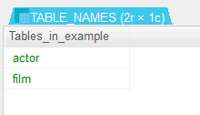
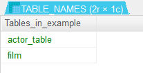
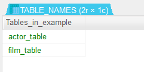
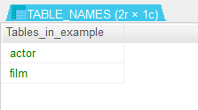
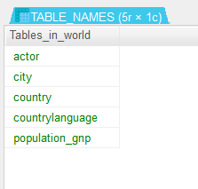

# 테이블 이름 바꾸기 : rename
- rename :
   - 테이블의 이를 바꾸기
   - 테이블을 다른 데이터베이스로 이동하기 : 복사가 아니라 이동

## 현재 테이블
- actor와 film 테이블이 있다
```
show tables from example ; 
```


### 테이블 이름 바꾸기
- actor 를 actor_table 로 변경
```
rename table actor to actor_table ;
```


- alter 와 rename 을 함께 사용 가능
- film 을 film_table 로 변경
```
alter table film rename film_table ;
```


### 테이블 이름 여러개를 한번에 바꾸기
- rename 을 사용하면 여러개의 테이블의 이름을 한번에 바꿀 수 있다.
- actor_table -> actor / film_table -> film 으로 변경
```
rename table actor_table to actor,
	     film_table to film ;
```


### 테이블을 다른 데이터 베이스로 이동시키기
- 테이블을 다른 데이터베이스로 이동시킬 수 있다.
- example 데이터베이스에 있는 actor 테이블을 world 데이터베이스로 이동
- example 데이터베이스에서는 사라지고 world 데이터베이스로 이동한다.
```
alter table example.actor rename world.actor ;
```


