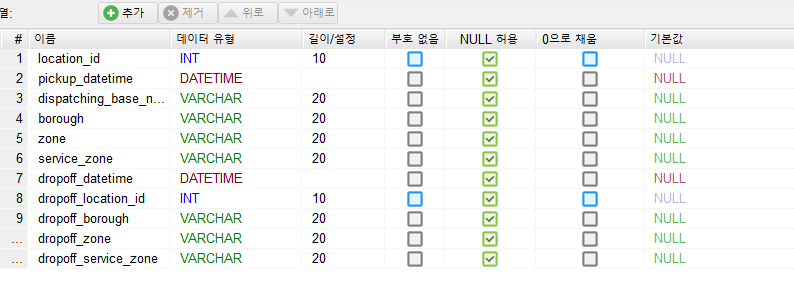
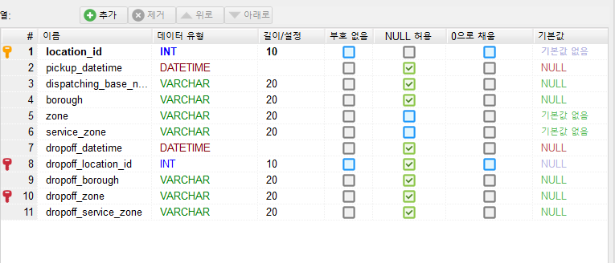

# MySQL 문법 기본 정리
- HidiSQL을 기반으로 정리함

### 1. 데이터 베이스 만들기
- 라이드헤일링 서비스인 공유형 택시의 운행 데이터를 가정으로 만들어 보기.
```sql
CREATE DATABASE taxi_trips ; 
```

### 2. 데이터 베이스 선택하기
```spl
USE taxi_trips ; 
```

### 3. 현재 선택된 데이터 베이스 확인
```spl
SELECT DATABASE() ; 
```


### 4. 테이블 만들기
- 현재 선택된 데이터 베이스 하위에 테이블이 만들어 진다.
- 기본구조

```spl
CREATE TABEL [테이블이름] (
     컬럼명 데이터유형 제약조건,
     컬럼명 데이터유형 제약조건,
     컬럼명 데이터유형 제약조건,
     ...
)
```

#### 1) 제약조건이 없는 테이블 생성
- 테이블 생성시 데이터 유형 설정

```sql
CREATE TABLE taxi_info_1 (
	location_id INT(10),
	pickup_datetime DATETIME,
	dispatching_base_num Varchar(20),	
	borough Varchar(20),
	zone Varchar(20),
	service_zone Varchar(20),
	dropoff_datetime DATETIME,
	dropoff_location_id INT(10),
	dropoff_borough Varchar(20),
	dropoff_zone Varchar(20),
	dropoff_service_zone Varchar(20)
) ;
```



#### 데이터 유형
- 실제 데이터에 따라서 어떤 데이터 유형을 설정할지 달라진다.
- 문자형 데이터 타입


- 숫자형 데이터 타입


- 날짜형 데이터 타입


- 이진 데이터 타입


#### 2) 제약조건이 있는 테이블 생성
- ```제약조건 constraint``` : 데이터를 입력받을 때 실행되는 검사 규칙
- **NOT NULL** : NULL 값을 저장할 수 없다. 다만 데이터 입력시 해당 필드의 데이터가 생략되더라도 입력은 된다. 
- **UNIQUE** : 서로 다른 값을 가져야 한다. 중복된 값을 저장할 수 없다. 
- **PRIMARY KEY** : NOT NULL과 UNIQUE 제약조건을 모두 설정한다. NULL 값을 가질 수 없고, 중복된 값을 갖지 못한다.
   - PRIMARY KEY는 한 테이블서 하나의 컬럼에만 적용할 수 있다. UNIQUE는 여러 테이블에 가능.
   - 단 기존의 컬럼의 제약조건을 PRIMARY KEY로 수정할 경우 NOT NULL 제약조건이 걸려 있어야 한다. 
   - 기본키라고도 부른다.
- **FOREIGN KEY** : 다른 테이블과 연결해 주는 기능이다. 외래키라고도 부른다.
   - FOREIGN KEY order -> REFERENCE customer : order 컬럼이 customer 컬럼을 참조한다. customer 컬럼에 따라서 order 컬럼의 입력이 변경된다.
- **FORIEGN KEY의 세부기능 설정**
   - ON DELETE 데이터 삭제, ON UPDATE 데이터 수정
   - CASCADE : 참조 컬럼에서 수정, 삭제가 발생하면 참조되는 컬럼에서도 동일 발생
   - SET NULL : 참조 컬럼에서 수정, 삭제가 발생하면 참조되는 컬럼은 NULL로 변경됨
   - NO ACTION : 참조 컬럼에서 수정, 삭제가 발생해도 참조되는 컬럼은 변경되지 않는다.
   - SET DEFAULT : 참조 컬럼에서 수정, 삭제가 발생하면 참조되는 컬럼은 기본값으로 변경된다.
   - RESTRICT : 참조 컬럼에 데이터가 남아있으면, 참조되는 테이블의 데이터를 수정, 삭제할 수 없다. 
   - FORIEGN KEY는 따로 정리할 것
```sql
CONSTRAINT 외래키명
FOREIGN KEY (참조되는 컬럼명)
REFERENCES 참조테이블명(참조 컬럼명) ON DELETE CASCADE
```

- 제약조건이 있는 테이블 생성
```sql
CREATE TABLE taxi_info_2 (
	location_id INT(10) PRIMARY KEY,
	pickup_datetime DATETIME,
	dispatching_base_num Varchar(20),
	borough Varchar(20),
	zone Varchar(20) NOT NULL,
	service_zone Varchar(20) NOT NULL,
	dropoff_datetime DATETIME,
	dropoff_location_id INT(10) UNIQUE,
	dropoff_borough Varchar(20),
	dropoff_zone Varchar(20) UNIQUE,
	dropoff_service_zone Varchar(20)
) ;
```



