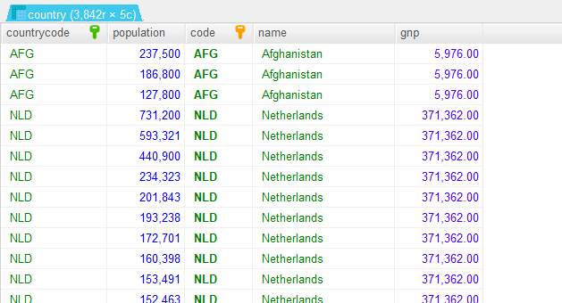

# 쿼리문 안의 쿼리문 : subquery
- 쿼리문 안에 쿼리문을 작성할 수 있다. 
- 원하는 데이터를 추출하기 위해 테이블간에 여러가지 조건을 사용할 수 있다.
- select 절, from 절, where 절에 subquery 를 사용할 수 있다.

### select 절에 subquery 사용하기
- 각각의 테이블의 특정 컬럼의 데이터를 합산한 결과를 하나의 테이블에서 보고 싶을 때 사용
- 나라의 수, 도시의 수, 언어의 수를 한 테이블에 출력
```
select
     (select count(name) from city) as total_city,
     (select count(name) from country) as total_country,
     (select count(distinct(language)) from countrylanguage) as total_language
from dual ;
```


- 인구 1억명 이상인 도시의 갯수, 인구 5백만명 이상인 도시의 갯수, 사용율이 30% 이상인 언어의 갯수
```
select
     (select count(name) from country where population > 100000000) as big_country,
     (select count(name) from city where population > 5000000) as big_city,
     (select count(language) from countrylanguage where percentage > 30) as big_lang
from dual ;
```


### from 절에 subquery 사용하기
- 다른 테이블의 필터링 된 데이터와 이것과 매칭되는 다른 테이블의 데이터를 합하여 한 테이블에 나타낼 때 사용
- 5백만명 이상인 도시의 코드와 이름, 인구수, 국가코드, 국각이름, 정부형태 출력하기
```
select *
from
    (select countrycode, name, population
     from city
     where population >= 5000000) as city
join
    (select code, name, governmentform
     from country) as country
on city.countrycode = country.code ;
```


- 천만명 이하인 도시의 이름, 국가코드, 국가이름, gnp 출력하기
```
select *
from
    (select countrycode, population from city where population <= 1000000) as small_city
join
    (select code, name, gnp from country) as country_info
on small_city.countrycode = country_info.code ;
```


### where 절에 subquery 사용하기
- 현재 테이블을 필터링하기 위한 조건으로 다른 테이블의 필터링 결과를 사용할 수 있다.
- where 절에 사용된 subquery 의 select 는 출력되지 않는다.
- subquery 안에 사용된 select 의 컬럼은 한 개만 가능. 
- 8백만 명 이상인 국가코드, 국가이름, 대통령이름 출력
```
select code, name, headofstate
from country
where code in (select distinct(countrycode) from city where population >= 8000000) ;
```


- 1900년 이후 독립한 국가들의 도시이름, 인구수 출력
- 1900년 이후 독립한 국가들 필터링은 country 테이블에서 하고 이것을 city 테이블의 국가코드와 대조하여 도시이름과 도시의 인구수를 출력한다.
```
select countrycode, name, population
from city
where countrycode in (select distinct(code) from country where indepyear > 1900) ;
```

