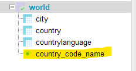
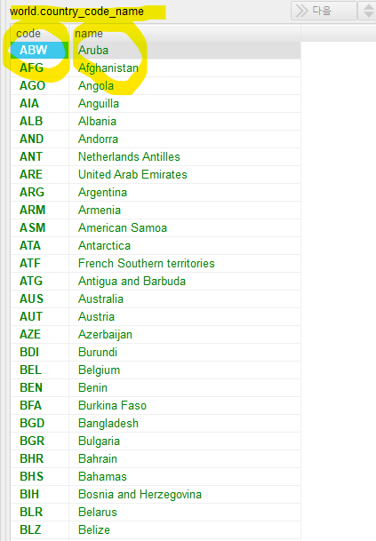
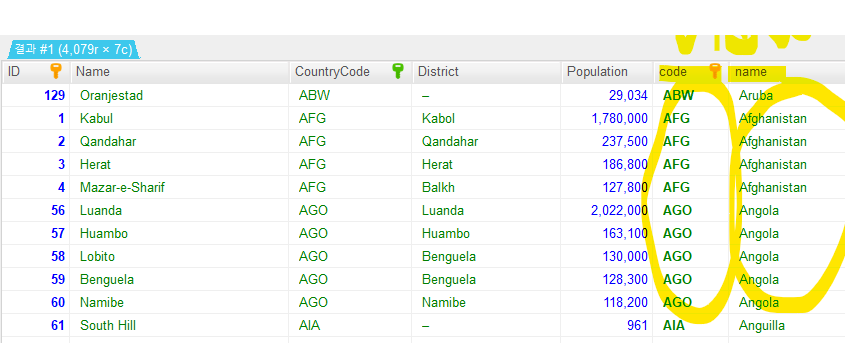
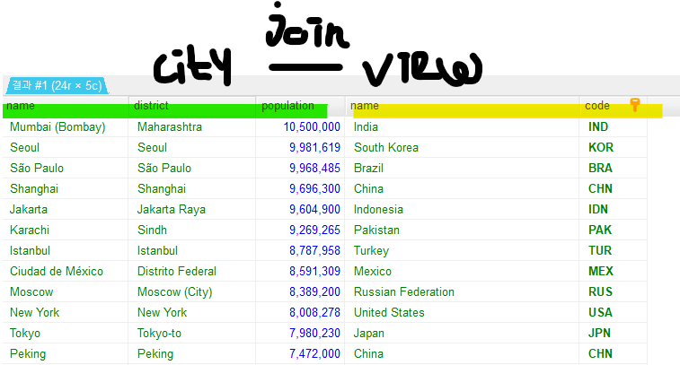
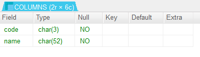
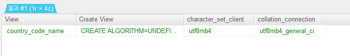
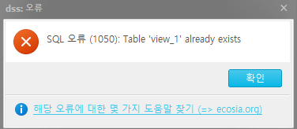
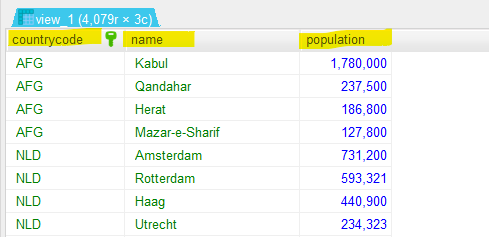

# view
- 가상의 테이블이다. (임시적), 실제 데이터를 저장하고 있는 것은 아니다.
- 특정 데이터를 모아서 view에 모아서 테이블 처럼 사용할 수 있다.
- 한번 생성 된 view는 수정과 인덱스 설정이 불가능 하다.
- view를 사용하여 쿼리를 단순하게 만들 수 있다. 

```sql
CREATE VIEW <뷰이름> AS
(QUERY)
```

### 예시
- world 데이터베이스에 coutry 테이블에서 국가코드와 국가이름이 있는 view 생성

```sql
CREATE VIEW country_code_name AS
SELECT code, name
FROM country ;
```




#### city 테이블과 country_code_name view를 합하기
- city 테이블에는 없는 국가의 이름 데이터를 하나의 테이블에서 볼 수 있다.

```sql
SELECT *
FROM city
JOIN country_code_name
ON city.countrycode = country_code_name.code ; 
```




#### city + view 에서 도시인구가 5백만 이상인 데이터 조회
- 기존 테이블과 view를 합한 결과물은 임시적인 테이블과 같다.
- 이 결과물에서 바로 특정 조건으로 데이터 조회를 할 수 있다.
- view를 사용하지 않았으면 city 테이블과 country 테이블을 subquery 등의 다른 방법을 사용해야 한다.

```sql
SELECT city.name, district, population, country_code_name.name, country_code_name.code
FROM city
JOIN country_code_name
ON city.countrycode = country_code_name.code
WHERE population >= 5000000
ORDER BY population DESC ;
```




### 다른 기능

#### view의 컬럼 구조 확인

```sql
DESC country_code_name ; 
```



#### view의 세부정보 확인

```sql
SHOW CREATE VIEW country_code_name ; 
```



#### view 덮어 쓰기
- 이미 만들어 놓은 view에 새로운 데이터를 덮어씌우는 기능
- 같은 이름으로 view를 만들 수 없다. 

- 새로운 veiw 생성 : 국가코드, 언어, 언어사용률

```sql
CREATE VIEW view_1 AS
SELECT countrycode, language, percentage
FROM countrylanguage ;
```

- view_1으로 새로운 view 생성 : 국가코드, 도시이름, 도시인구
- 기존에 있는 view 이므로 에러가 발생한다.

```sql
CREATE VIEW view_1 AS
SELECT countrycode, name, population
FROM city ;
```



- CREATE OR REPLACEMENT 로 view 덮어 씌우기
- 기존의 이름의 view로 새로운 데이터를 덮어 씌울 수 있다. 

```sql
CREATE OR REPLACE VIEW view_1 AS
SELECT countrycode, name, population
FROM city ;
```

- view_1 이름으로 새로운 데이터가 생성되었다.



